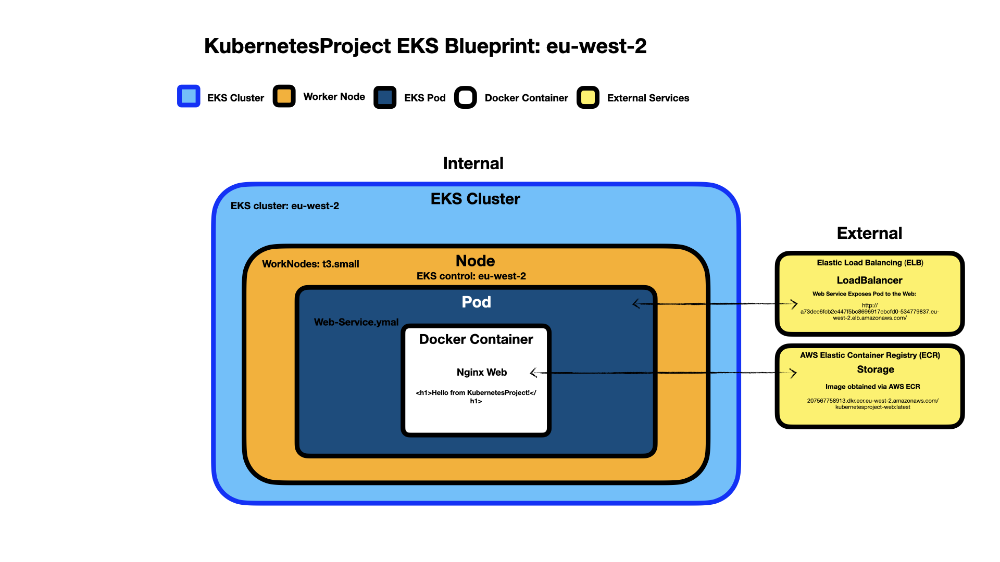

# KubernetesProject

## Overview

This repository contains the configuration and resources for `KubernetesProject`, a Kubernetes cluster deployed on Amazon Elastic Kubernetes Service (EKS) in the `eu-west-2` (London) region. The project demonstrates hosting a simple Nginx web server in a containerized environment, exposed to the internet via a LoadBalancer service.

## Purpose

The goal of this project is to learn and showcase the deployment of a Kubernetes cluster on EKS, including:

- Cluster creation and management.
- Pod and service configuration.
- Networking with a LoadBalancer.
- Storage using AWS Elastic Container Registry (ECR).
- Visualization of the architecture via a blueprint diagram.

## Architecture

The project follows this blueprint:

- **EKS Control Plane**: Manages the cluster in `eu-west-2`.
- **Nodes**: `t3.small` EC2 instances in the `WorkNodes` node group.
- **Pod**: Runs an Nginx container serving a custom web page.
- **Networking**: Exposed via an Elastic Load Balancer (ELB).
- **Storage**: Image stored in AWS ECR.
- **Configuration**: Defined in YAML manifests.



## Files

| File Name                             | Description                                                         |
| ------------------------------------- | ------------------------------------------------------------------- |
| `Dockerfile`                          | Defines the Nginx container image with `index.html`.                |
| `index.html`                          | Custom web page content (`<h1>Hello from KubernetesProject!</h1>`). |
| `Web-Pod.yaml`                        | Kubernetes pod manifest for the Nginx container.                    |
| `Web-Service.yaml`                    | Kubernetes service manifest for the LoadBalancer.                   |
| `KubernetesProject_EKS_Blueprint.png` | Architecture diagram of the setup.                                  |

## Setup Instructions

1. **Prerequisites**:

   - AWS account with EKS, ECR, and EC2 access.
   - `awscli`, `eksctl`, and `kubectl` installed.
   - Docker Desktop (for building the image locally).

2. **Cluster Creation**:
   ```bash
   eksctl create cluster --name KubernetesProject --region eu-west-2 --nodegroup-name WorkNodes --node-type t3.small --nodes 1
   aws eks update-kubeconfig --name KubernetesProject --region eu-west-2
   ```
